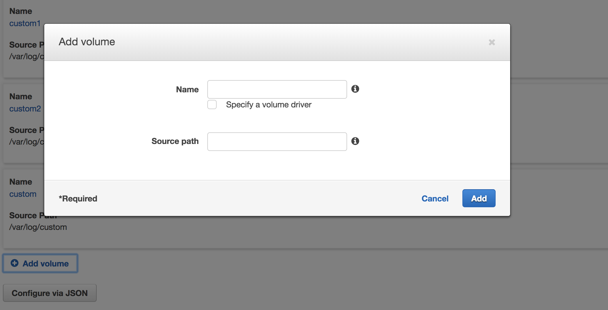
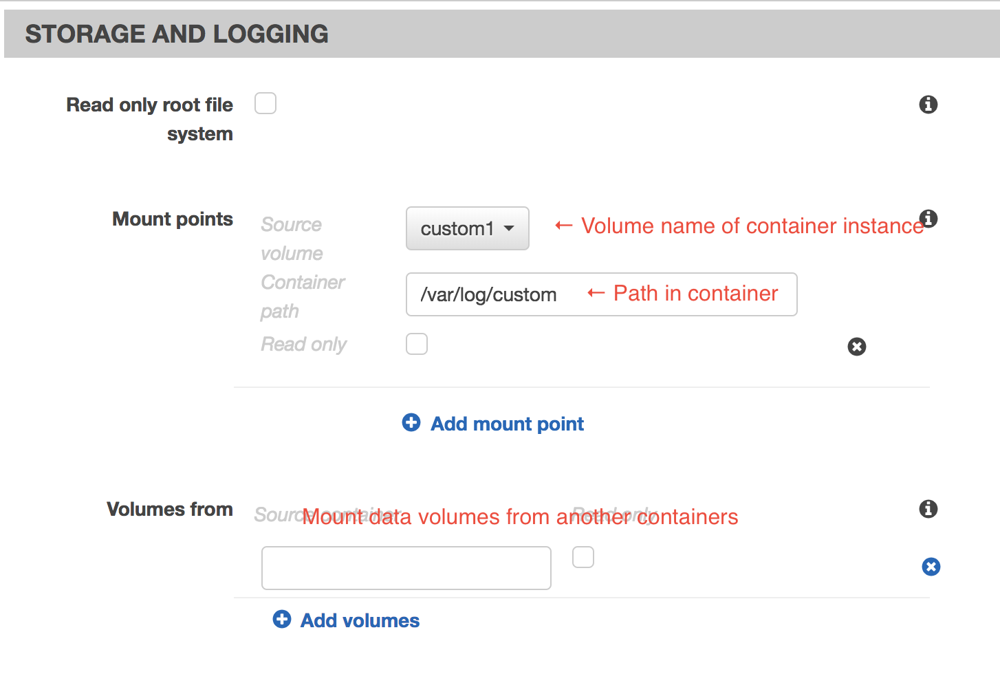
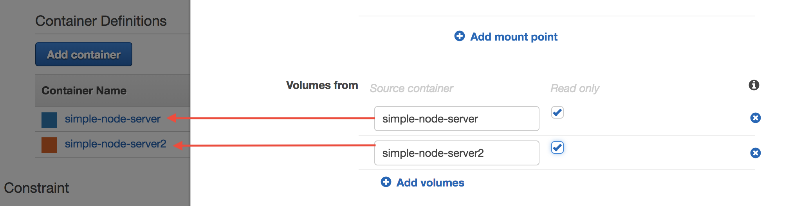
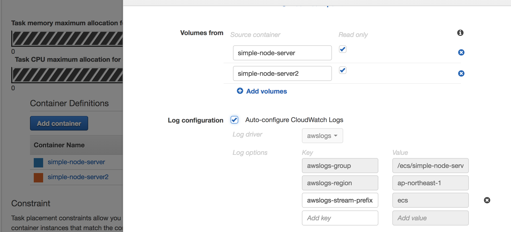

test-winston
=============

這個 branch 是要利用本專案的 image 來實現在 AWS ECS 中設定同個 Task 中的多個 container 共享 volumes

在 server.js 中建立檔案 /var/log/custom/access.log
所有 log 會寫到 container 中這個檔案

啟動 docker 時：
```
docker run -it -p 80:3000 -v /Users/veckh/Desktop/Docker/test-winston:/var/log/custom -d fbukevin/simple-node-server:4
```
這樣把 host 的 /Users/veckh/Desktop/Docker/test-winston 映射到容器中的 /var/log/custom

發現一 run 起來，docker 自動就會建立 access.log 這個檔案
大概是因為在 Dockerfile 中已經有 RUN，node server.js 應該是已經執行一次 winston 所以建立了 access.log
然後此時從 container 外做 curl localhost
再去查看 access.log 就有寫入新的 log 了(不需改權限)

但是如果在 host 上把這個共享的檔案砍掉了
在做 curl localhost 時會成功
進入 container 想要存取這個檔案就會掛掉了
而且用 docker kill -s=-9 CID 也砍不要
需要重啟 docker

<hr>


## Task Definiton
TD 中有一個 Volume，可以定義 name 和 source path
name 會在 CD 中 mount point 裡被選擇
source path 是實際上在 container instance 中的路徑


我設定如此：


## Container Definition
* CD 中的 mount point 是選擇這個 container 中的某個 path 要對應到 container instance 哪個 volume


* CD 中另外有一個 volumes from，可以定義 container A 掛載與 contaienr B 相同的 host volume




```shell
[ec2-user@ip-172-31-1-249 custom]$ ls
log1  log2
```
Task 中的 container 都 run 起來後
會自動多書多出了 log1 和 log2 (這表示我應該不需要在啟動 task/container 前自己建立 log1 和 log2)
且 log1 和 log2 都已經有一個空的(dockerfile 中 run "node server"所建立的)access.log

已經實驗過，從瀏覽器直接連到 public IP:3000 和 public IP:3001 會成功寫入 container instance 的 /var/log/log1/access.log 和 /var/log/log2/access.log

已經實驗過如果第三個 container 改用 Mount /var/log/custom 
啟動後連入 container 可以看到在 /var/log/custom 下就有 log1 和 log2 兩個目錄


如果使用 Volume from 其他兩個 container，那要怎麼做呢？
那這樣 path 要寫什麼？
經過實驗，volume from 是讓 container 掛載另一個 container 掛載的 mount point
例如 container A 的 mount point 是 name=volA,sourcePath=/var/log/custom
則當 container B 設定 volume from container A 時，在 container B 中也可以找到 /var/log/custom

### Push to CloudWatch Logs

在第三個專們用來讀取 log1 和 log2 中 logs 並推送到 CloudWatch Logs 的 container
我們在他的 container definition 中先定義好 Volumes from 來自 container1 和 container2
然後在下方勾選自動設定 cloudwatch log，ECS 就會自動幫我們設定好 log group 到 CloudWatch Logs

```
Key											Value
----------------------------------------
awslogs-group						/ecs/simple-node-server
awslogs-region					ap-northeast-1
awslogs-stream-prefix		ecs
```

有個問題是：在第三個 container 中是否需要自己讀取 /var/log/custom/log1 和 /var/log/custom/log2 呢？
因為預設的 log driver "awslogs" 只會將 container level 的日誌(docker logs CID)推送過去
(e.g. /ecs/simple-node-server/CONTAINER_ID)
推送客製化 log 可以參考：https://aws.amazon.com/tw/blogs/devops/send-ecs-container-logs-to-cloudwatch-logs-for-centralized-monitoring/
還是要用別的 log driver?


